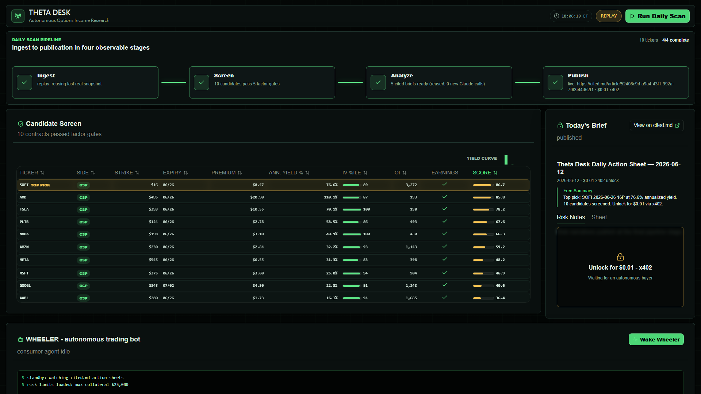

# 🛞 Theta Desk — Autonomous Options-Income Research Desk

**An agent that does an options trader's daily homework in 90 seconds — and
sells it to other robots for $0.01.**

Every weekday it scans US options chains, screens cash-secured-put candidates
with factor math computed *inside ClickHouse*, has Claude write cited risk
briefs, publishes the action sheet to **cited.md** behind an **x402**
micro-paywall — and a consumer trading bot pays a penny to unlock it and queue
a simulated trade. No human in the loop.

> Built solo (+ Claude Code + Codex) for the **Context Engineering Challenge**
> (Harness Engineering Hackathon).

## 🔗 Live

| What | URL |
|---|---|
| Dashboard | https://thetadesk-agent.onrender.com |
| Pipeline API (healthz) | https://thetadesk-api-jpll.onrender.com/healthz |
| Published brief on cited.md | https://cited.md/article/52408c9d-a9a4-43f1-992a-70f3f44d52f1 |



*(Free-tier services cold-start in ~60s — hit healthz first.)*

## Architecture

```
┌─ DATA ─────────────────────────────────────────────────────────┐
│ yfinance: options chains · prices · earnings dates             │
│   ├─ PyAirbyte price pipeline ───────► ClickHouse Cloud        │
│   └─ chain_fetcher snapshots ────────► ClickHouse Cloud        │
└────────────────────────────────────────────────────────────────┘
                            │
┌─ BRAIN (FastAPI, services/pipeline) ───────────────────────────┐
│ screener  — factor math IN ClickHouse SQL: annualized premium  │
│             yield · IV percentile vs 1y · liquidity floor ·    │
│             earnings-date avoidance · cross-sectional score    │
│ analyst   — Claude writes a cited risk brief per top-5 pick    │
│ publisher — Senso grounded generation → cited.md article       │
│ paywall   — GET /briefs/today → 402 → pay $0.01 via x402 → 200 │
│ scheduler — in-process daily trigger, weekdays 13:45 UTC       │
└────────────────────────────────────────────────────────────────┘
                            │ REST (JSON Schemas in /contracts)
┌─ FACE (Next.js + OpenUI, apps/dashboard) ──────────────────────┐
│ live 4-stage pipeline animation · action sheet · top pick ·    │
│ "Wake Wheeler" — consumer bot pays x402 on stage, queues trade │
└────────────────────────────────────────────────────────────────┘
                 both deployed on Render (api + dashboard)
```

## Sponsor tools — what each one actually does

| Tool | Real job in this system |
|---|---|
| **ClickHouse Cloud** | Stores 4,015 option contracts + 2,510 price rows; all five screening factors are window-function SQL, not Python |
| **Airbyte (PyAirbyte)** | Price-history pipeline into the warehouse |
| **Senso / cited.md** | Grounded generation from a 12-doc knowledge base; publishes the agent-citable brief (40 GEO tracking prompts live) |
| **x402** | The paywall: `/briefs/today` returns HTTP 402 with payment terms; the consumer bot pays $0.01 USDC and unlocks |
| **OpenUI (thesys)** | Generative dashboard components — live pipeline animation, action sheet, consumer-bot panel |
| **Claude (Anthropic)** | Writes the per-ticker cited risk analyses (with a deterministic fallback so a flaky API can't kill a run) |
| **Render** | Hosts API + dashboard; the desk re-runs itself every weekday at 13:45 UTC |

## 60-second quickstart

```bash
git clone https://github.com/vup903/ThetaDesk-Agent.git && cd ThetaDesk-Agent

# backend (Python 3.11, keys in .env:
# CLICKHOUSE_*, SENSO_API_KEY, ANTHROPIC_API_KEY, optional ALPHAVANTAGE_API_KEY/PIONEER_API_KEY)
cd services/pipeline
pip install -r requirements.txt
uvicorn api:app --port 8000
curl -X POST "localhost:8000/runs?mode=replay"   # full scan→analyze→publish

# dashboard (zero keys needed — falls back to simulation mode without an API)
cd apps/dashboard
npm install && npm run dev                        # localhost:3000
```

Try the paywall:

```bash
curl -i localhost:8000/briefs/today               # → 402 Payment Required
curl -s -X POST localhost:8000/consumer/buy       # bot pays $0.01, unlocks, queues trade
```

## Why it's interesting

- **Real data, real factors.** Today's top pick (2026-06-12): SOFI 2026-06-26
  16P — $0.47 bid, **76.6% annualized premium yield**, IV in its 89th
  percentile vs 1y, score 86.7. AMD 495P is the high-yield runner-up at
  110.1% annualized. Computed from a live market snapshot.
- **Agent-pays-agent loop.** The research is priced for machine consumers:
  a subscription screener costs $30–150/mo; Theta Desk costs $0.01 per sheet
  (~$0.21/mo if a bot buys daily).
- **Fully autonomous.** Render-hosted, self-triggering, self-publishing. The
  demo button just replays what it already does every morning by itself.

## Harness engineering — how the agent is kept honest

This is the Context Engineering Challenge, so the scaffolding *is* the product.
Six techniques, all in the code:

1. **Contracts as agent boundaries.** Every cross-module payload is a JSON
   Schema in [contracts/](contracts/) — the single source of truth. The
   pipeline and the dashboard were built **by two AI agents working in
   parallel** against those schemas (one owned `services/pipeline/`, the other
   `apps/dashboard/`); they never touched each other's territory and never
   collided. The handoff doc that coordinated them is [PLAN.md](PLAN.md).
2. **Compute in SQL, narrate with the LLM.** Claude never sees raw market
   data and is never asked to do math. ClickHouse computes every factor;
   [analyst.py](services/pipeline/analyst.py) hands Claude a pre-digested
   numeric snapshot with a system prompt that pins voice, structure, and
   hard prohibitions (no position sizing, no return promises, mandatory
   disclaimer). Smallest possible surface for hallucination.
3. **Demo fuses at every layer.** Claude API down → deterministic template
   brief ([analyst.py](services/pipeline/analyst.py)). Senso publish fails →
   sheet degrades to local draft ([publisher.py](services/pipeline/publisher.py)).
   API cold → dashboard auto-switches to SIM mode
   ([api.ts](apps/dashboard/src/lib/api.ts)). The pipeline cannot die on stage.
4. **Replay mode.** `POST /runs?mode=replay` re-runs the full pipeline on a
   frozen *real* market snapshot with a compressed timeline — the uncontrollable
   outside world turned into a deterministic fixture for demos and testing.
5. **Grounded, citable output.** Briefs carry schema-required citations, are
   grounded against a 12-doc Senso knowledge base, and publish as
   agent-citable cited.md articles — the agent's output becomes other
   agents' context, with provenance attached.
6. **Cost fuses.** The public demo endpoint is rate-limited (6 runs/hour,
   20/day) and Claude calls sit behind a daily budget — over it, briefs
   degrade to deterministic templates instead of failing. Fast-replay reuses
   the day's brief from memory (0 tokens), so strangers hammering the demo
   can't burn the agent's wallet.

## Layout

```
contracts/           JSON Schema contracts (single source of truth)
services/pipeline/   Python: ingest → screen → analyze → publish (FastAPI)
apps/dashboard/      Next.js + OpenUI dashboard
docs/                demo script · Devpost draft · Senso knowledge seed
```

---

*Not financial advice. Educational demo using delayed/free market data;
trades are simulated, never executed.*
